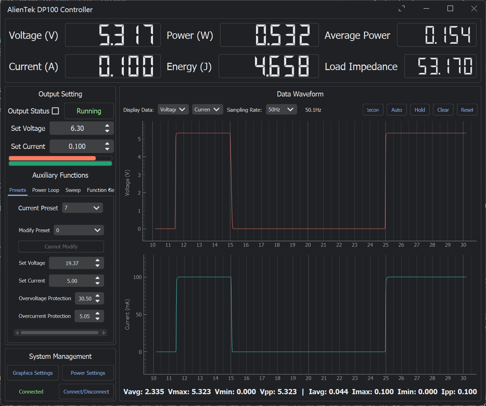

# A PyQt5-based PC GUI for Aliantek DP100 digital power supply

Translated to English by utilizing ChatGPT-4. There could be errors in translation resulting in nonsensical menu names (hopefully that will not be the case).

- Basic parameter setting, preset group management, setting modification
- Data acquisition, plotting, analysis, and saving up to 100Hz (adjustable)
- PID constant power control
- Parameter scanning (voltage/current)
- Function generator (sine/square/triangle/sawtooth/random)
- Operation sequence (execute operations in sequence)
- Material Design style

## Dependencies

A modified `QFramelessWindow` package is used in the `lib` folder.

The release provides a packaged .exe file, no need to install the Python environment.

> The interface font uses Sarasa UI and has no fallback. Remember to install one from the [Microsoft Store](https://www.microsoft.com/store/productId/9MW0M424NCZ7?ocid=pdpshare).

## About the size of the binary file

When PyInstaller packages Qt programs, it will automatically add unnecessary Qt Plugins, causing the binary file to be too large. Carefully modifying the spec file to exclude unnecessary DLLs and libraries can reduce the size to about 30MB, but I am too lazy to change it, so it stays as it is.

## Acknowledgements

Shout out to:

- @ElluIFX's [DP100-PyQt5-GUI](https://github.com/ElluIFX/DP100-PyQt5-GUI) project as a helpful reference and source of the DLL for reverse-engineering.
- @vinivius [DP100_PS_PC-Sofware](https://github.com/vinivius/DP100_PS_PC-Sofware) for posting firmware, software, relevant DLLs and users manual

# Notes

At the time of writing sequence generator still doesn't work, perhaps I've broken its functionality or it didn't work before (did not check as I cant read Chinese). Definitely something I will look into.
