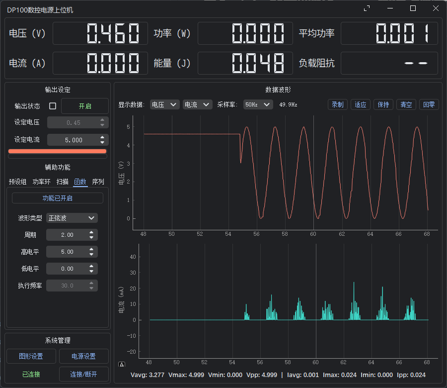

# 基于PyQt5的正点原子DP100数控电源上位机

## 功能

- 基本参数设定、预设组管理、设置修改
- 高达100Hz（可调）的数据采集、绘图、分析、保存
- PID恒功率控制
- 参数扫描（电压/电流）
- 函数发生器（正弦/方波/三角波/锯齿波/随机波）
- 操作序列（顺序执行操作）
- Material Design风格

## 依赖

使用了修改后的`QFramelessWindow`包，在`lib`文件夹中

release提供了打包好的exe文件，无需安装python环境

## Other

写着方便自己用的，没时间接受pr，有需要请自行fork

## Screenshots

