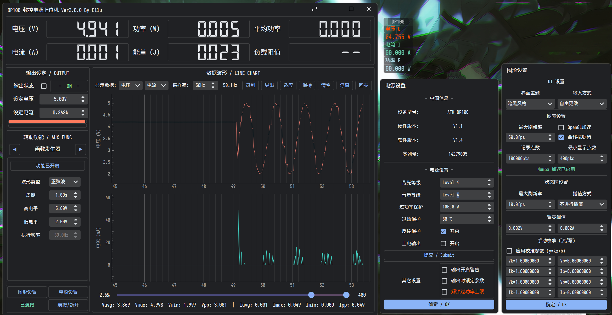
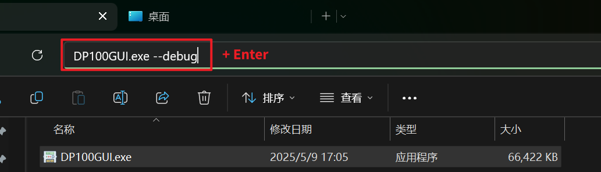

# 正点原子 DP100 数控电源上位机

基于PyQt5的正点原子DP100数控电源上位机
> [!NOTE]
> 项目现在同步到我其他上位机的最新代码, 引入大量新特性并大幅提高了绘制性能

## **[English Version](./readme_EN.md)**

## 功能

> [!IMPORTANT]
> **当前仍处于BETA状态,如果遇上任何问题请参考README最后的[日志获取方法],记录log后发issue请求修复**

### Python3 API

- 支持输出/电压/电流设置
- 读取设备状态
- 实时读取输出的ADC测量值

### PyQt5 GUI

- 基本参数设定、预设组管理、设置修改
- 高达100Hz（可调）的数据采集、绘图、分析、保存
  - 自定义波形缓冲区长度
  - **绘图缓冲区现在可以自由选择预览范围,同时记录百万个数据点**
- PID恒功率控制
- 参数扫描（电压/电流）
  - *绘制扫描响应曲线 (用于研究负载的特性)*
- 函数发生器（正弦/方波/三角波/锯齿波/随机波）
- 操作序列（以单次或循环执行动作序列）
- *电池模拟器 (支持自定义电池电压曲线/容量/内阻/串联)*
- *数据悬浮窗*
- 两种主题的Material Design风格
- *i18n支持 (中文/英文)*
- 开箱即用的便携可执行文件

### GUI环境变量

- MDP_ENABLE_LOG: 启用调试日志输出 (或用--debug参数启动)
- MDP_FORCE_ENGLISH: 强制使用英文UI (或用--english参数启动)
- MDP_SIM_MODE: 启用模拟模式, 允许在不连接设备的情况下测试UI功能 (或用--sim参数启动)

### 日志获取方法

使用`--debug`参数启动程序, 程序将在所在文件夹中创建dp100.log日志文件, 进行bug复现, 随后将日志文件附在issue中

