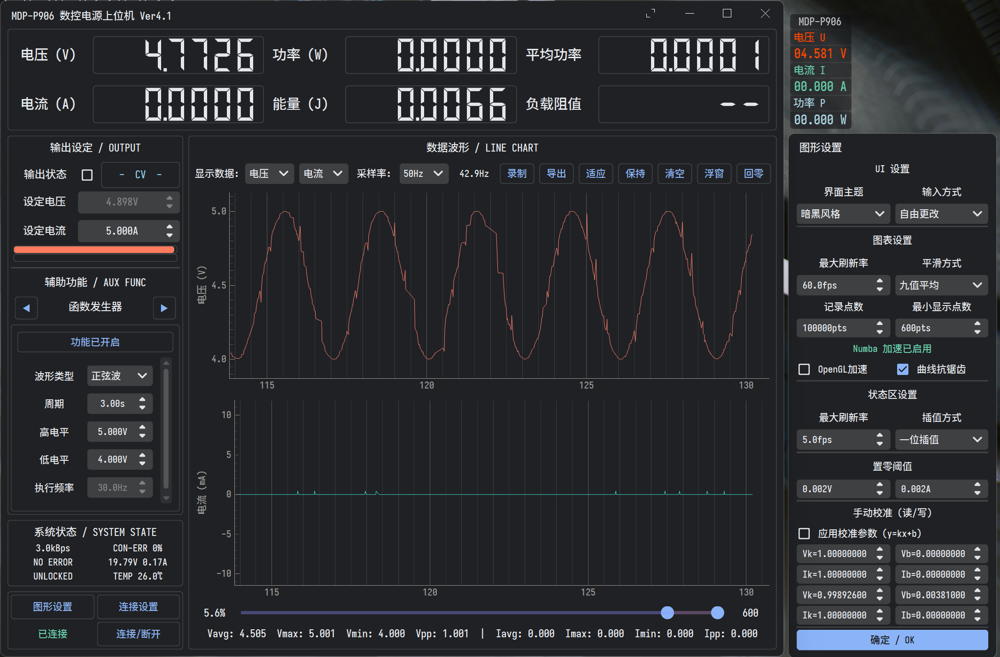
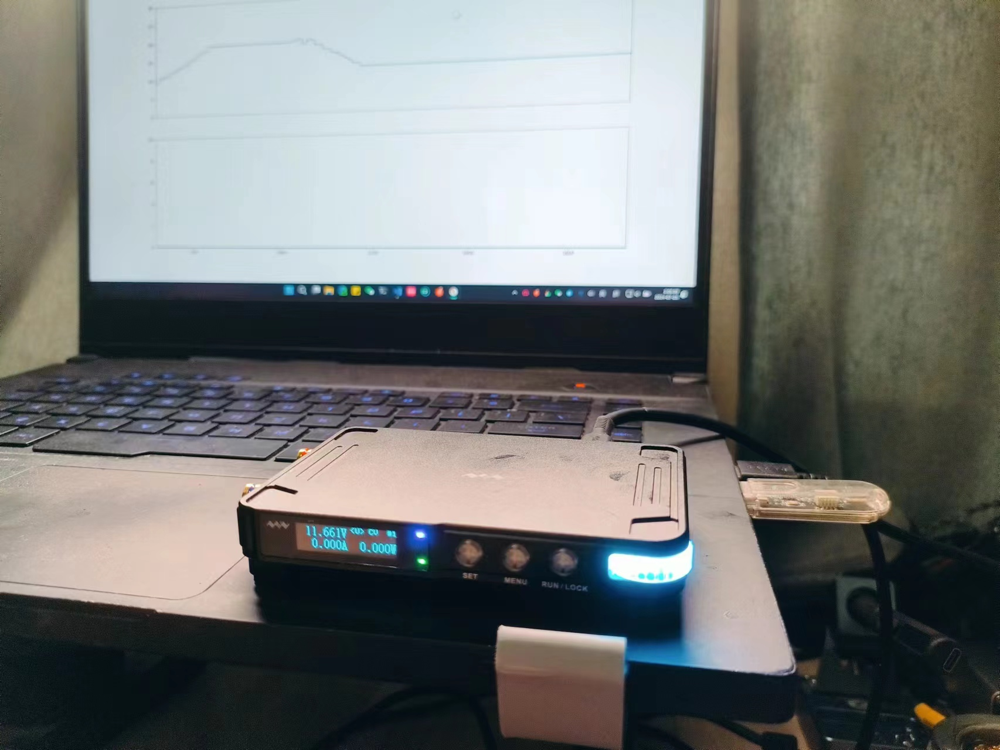
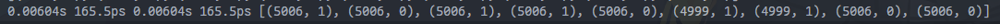
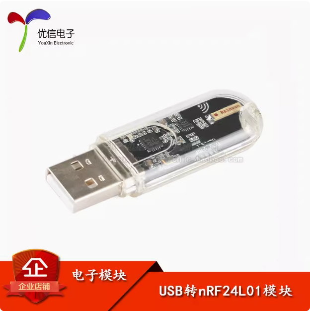
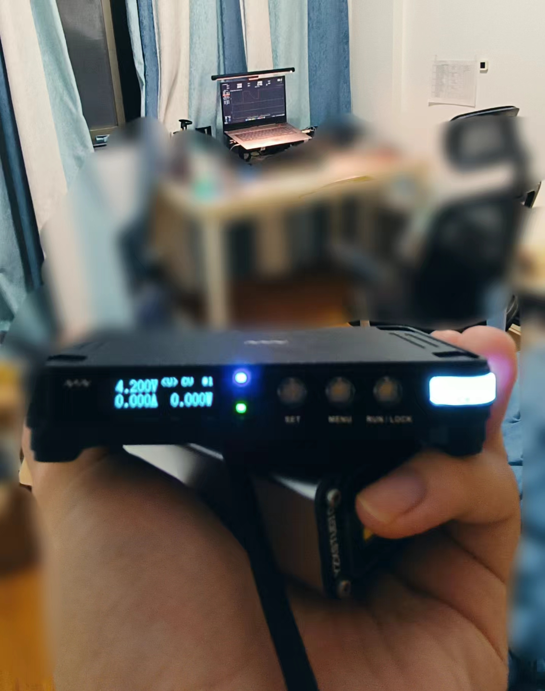
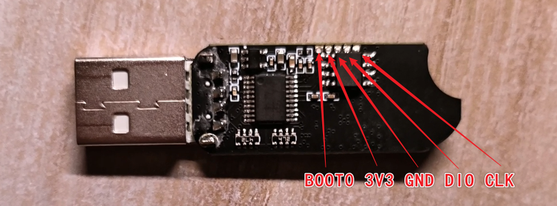
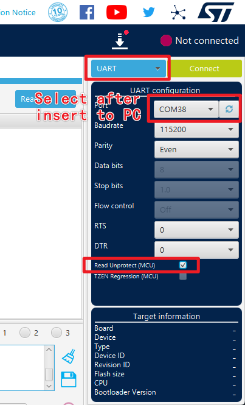
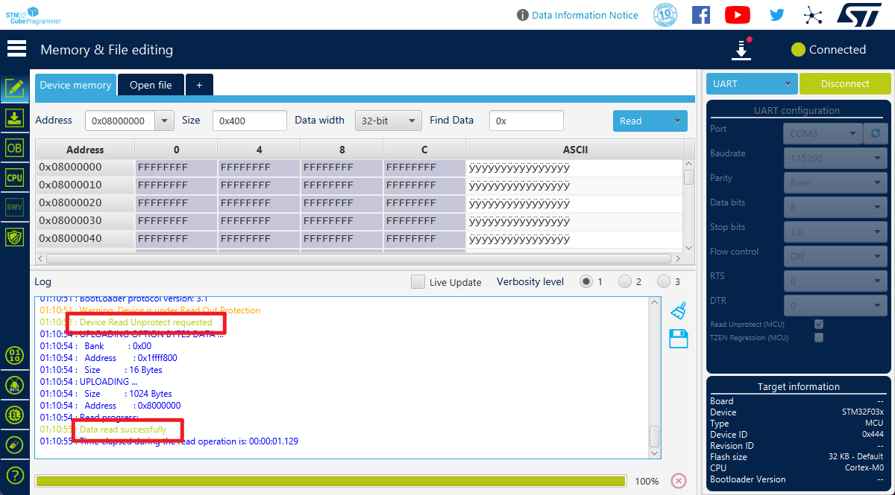
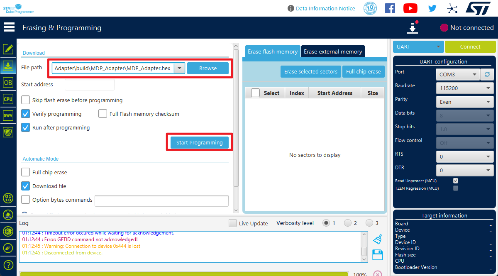
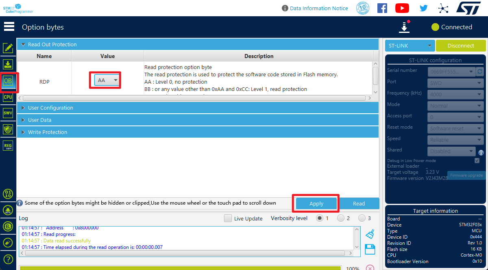

# Miniware MDP-P906 数控电源上位机

## **[English Version](./readme_EN.md)**

不需要MDP-M01显控模块即可对电源进行无线控制，同时支持P905(已测试, 见[#1](https://github.com/ElluIFX/MDP-P906-Controller/issues/1)和[#2](https://github.com/ElluIFX/MDP-P906-Controller/issues/2))

## 鸣谢

本项目中使用到的协议部分来源于[leommxj/mdp_commander](https://github.com/leommxj/mdp_commander)，如果没有这个项目我没有任何办法测试出M01和P906的通信协议.

在该项目的基础上花费大量时间优化通信质量，最终实现高达160fps的稳定且长时间数据获取.

## 功能

### Python3 API

- 支持输出/电压/电流设置
- 读取设备状态
- 实时读取输出的ADC测量值

### PyQt5 GUI

- 基本参数设定、预设组管理、设置修改
- 高达100Hz（可调）的数据采集、绘图、分析、保存
- PID恒功率控制
- 参数扫描（电压/电流）
  - 绘制扫描响应曲线 (用于研究负载的特性)
- 函数发生器（正弦/方波/三角波/锯齿波/随机波）
- 操作序列（以单次或循环执行动作序列）
- 电池模拟器 (支持自定义电池电压曲线/容量/内阻/串联)
- 数据悬浮窗
- 自定义波形缓冲区长度
- 两种主题的Material Design风格
- i18n支持 (中文/英文)
- 开箱即用的便携可执行文件 (Win Only / 源码跨平台可用)

## 使用方法

### 前提的前提

虽然下文说本项目需要买一个模块，但如果你手上正好有STM32+NRF24L01这个combo，你也可以简单的移植这个项目到你的设备上，只需要修改一下cubemx就行，HAL库就这点好

我逆向出的具体电路这里就不放了，可以直接看cubemx中的引脚定义

### 前提

本项目需要一个[淘宝](https://item.taobao.com/item.htm?spm=a1z09.2.0.0.521d2e8dccjOe1&id=601004335822&_u=p23lmea03490)上售价为30元的USB转NRF24L01模块，如下图

这个模块具有独立的PA功放，因此，相比于leommxj使用的Arduino Nano RF，它能实现高达两米的通信距离，但是，该模块使用了自己的协议来实现无线串口，这与控制设备所需要的原始NRF24L01数据流并不兼容

有意思的是，模块使用了一块正版的STM32F030F4P6作为主控，我们可以编写自己的程序覆写进去，实现对它硬件的废物利用

### 改造方法1

将模块的外壳撬开，翻到背面，可以看到如图的五个测试点

下载[STM32 CubeProgrammer](https://www.st.com/en/development-tools/stm32cubeprog.html)并打开，如图设置

现在，用一根镊子短接上图中的`BOOT0`和`3V3`两个测试点，**且在整个烧录过程中必须保持短接**

将模块插入电脑，选择正确的端口号后点击`Connect`进行连接，一切正常的话，应该如图所示，成功解除芯片上的读写保护

接下来切换到下载页，选择我发布在[release](https://github.com/ElluIFX/MDP-P906-Controller/releases/tag/image)中的固件包（当然，你也可以自行编译），完成固件烧录

### 改造方法2

和方法1没有本质区别，只是当通过BOOT0进入串口bootloader后不一定能解除读写保护，在这种情况下，如果你有ST-LINK，可以按如图所示的SWD接线进行连接，然后按下图勾选即可解除保护

### API控制

自行查看代码，注释写好了

[test_main.py](./test_main.py) 测试读取示例

[mdp_p906.py](./mdp_controller/mdp_p906.py) 完整API实现

### GUI控制

在release中可以直接下载打包好的版本，开箱即用

#### GUI 环境变量

- `MDP_ENABLE_LOG`: 启用调试日志输出 (或用`--debug`参数启动)
- `MDP_FORCE_ENGLISH`: 强制使用英文UI (或用`--english`参数启动)
- `MDP_SIM_MODE`: 启用模拟模式, 允许在不连接设备的情况下测试UI功能 (或用`--sim`参数启动)

## References (Thanks)

[leommxj/mdp_commander](https://github.com/leommxj/mdp_commander) 中的协议实现

[mokhwasomssi/stm32_hal_nrf24l01p](https://github.com/mokhwasomssi/stm32_hal_nrf24l01p) 中的NRF24L01P驱动实现

[be5invis/Sarasa-Gothic](https://github.com/be5invis/Sarasa-Gothic) 中的更纱黑体
