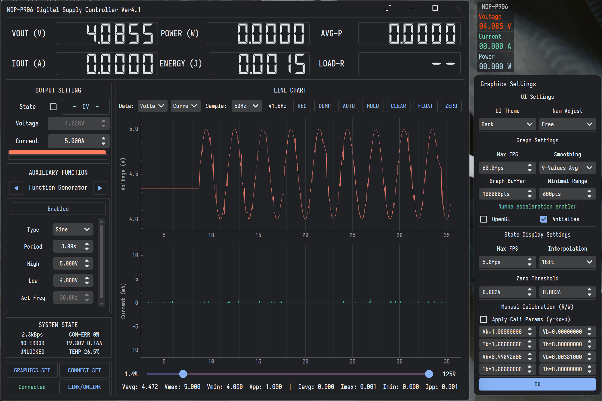
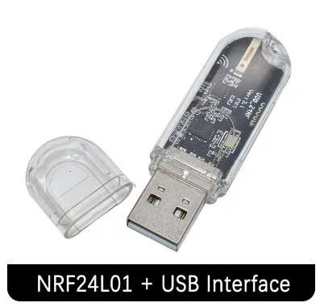

# Miniware MDP-P906 Digital Power Supply Controller

Wireless control of the power supply without the MDP-M01 display module, supporting P905 as well (tested, see [#1](https://github.com/ElluIFX/MDP-P906-Controller/issues/1) and [#2](https://github.com/ElluIFX/MDP-P906-Controller/issues/2)).

## Acknowledgements

The protocol part used in this project is derived from  [leommxj/mdp_commander](https://github.com/leommxj/mdp_commander). Without this project, I would have had no way to test the communication protocol between M01 and P906.

A lot of time was spent optimizing the communication quality based on this project, ultimately achieving stable and long-term data acquisition at up to 160fps.

## Features

### Python3 API

- Set output/voltage/current
- Read device status
- Real-time reading of ADC measurement values from the output

### PyQt5 GUI

- Basic parameter setting, preset group management, setting modification
- Data acquisition, plotting, analysis, and saving up to 100Hz (adjustable)
- PID constant power control
- Parameter scanning (voltage/current)
  - Plotting scanning response curves (for discovering load characteristics)
- Function generator (sine/square/triangle/sawtooth/random)
- Operation sequence (single or loop execution of action sequences)
- Battery simulator (supports custom battery voltage curves/capacity/internal resistance/series-connection settings)
- Data floating window
- Customizable waveform buffer length
- Material Design style with two color themes
- i18n support (zh-CN/en-US)
- Portable executable files ready to use (Win/Linux / Source Code Cross-Platform)

## Usage Instructions

### Prerequisite of the Prerequisite

Although the following text says that this project requires buying a module, if you already have an STM32 + NRF24L01 combo, you can easily port this project to your device by simply modifying cubemx. This is the only advantage of using the HAL library.

I won't include the specific circuit I reverse-engineered here; you can directly refer to the pin definitions in cubemx.

### Prerequisite

This project requires a USB to NRF24L01 module, sold for $5.67 on [AliExpress](https://www.aliexpress.com/item/1005006003453078.html?spm=a2g0o.productlist.main.7.3828oWBqoWBqd6&algo_pvid=27999fdf-f812-4149-b2a8-251e95c1cc29), as shown below:

This module has an independent PA amplifier, allowing for a communication range of up to two meters compared to the Arduino Nano RF used by leommxj. However, the module uses its protocol to implement a wireless serial port, which is not compatible with the original NRF24L01 data stream required to control the device.

Fortunately, the module uses a genuine STM32F030F4P6 as the main controller, allowing us to write our programs to repurpose its hardware.

### Modification Method 1

Pry open the module's case and flip it over to see five test points as shown in the image below:

Download [STM32 CubeProgrammer](https://www.st.com/en/development-tools/stm32cubeprog.html) and open it, setting it up as shown in the image below:

Now, use a pair of tweezers to short the `BOOT0` and `3V3` test points in the image above, and **keep them shorted throughout the entire flashing process**.

Insert the module into the computer, select the correct port number, and click Connect to connect. If everything goes well, you should see the image below, indicating the successful removal of the read-write protection on the chip.

Next, switch to the download page, select the firmware package I [released](https://github.com/ElluIFX/MDP-P906-Controller/releases/tag/image) (of course, you can also compile it yourself), and complete the firmware flashing.

### Modification Method 2

This method is essentially the same as Method 1, for the situation that when entering the serial bootloader via BOOT0, you may not be able to remove the read-write protection. In this case, if you have an ST-LINK, you can connect as shown in the SWD wiring diagram before, then check the box as shown in the image to remove the protection.

### Control by API

Refer to the code and the comments.

[test_main.py](./test_main.py) for example.

[mdp_p906.py](./mdp_controller/mdp_p906.py) for complete API.

### Control by GUI

I have released a PyInstaller packaged version, you can just download and run it. Everything is out of the box.

#### GUI Environment Variables

- `MDP_ENABLE_LOG`: Enable debug log output (or use `--debug` parameter)
- `MDP_FORCE_ENGLISH`: Force use English UI (or use `--english` parameter)
- `MDP_SIM_MODE`: Enable simulation mode, allowing testing UI functions without connecting to real device (or use `--sim` parameter)

## References (Thanks)

Protocol implementation from [leommxj/mdp_commander](https://github.com/leommxj/mdp_commander)

NRF24L01P driver implementation from [mokhwasomssi/stm32_hal_nrf24l01p](https://github.com/mokhwasomssi/stm32_hal_nrf24l01p)

Font from [be5invis/Sarasa-Gothic](https://github.com/be5invis/Sarasa-Gothic)
